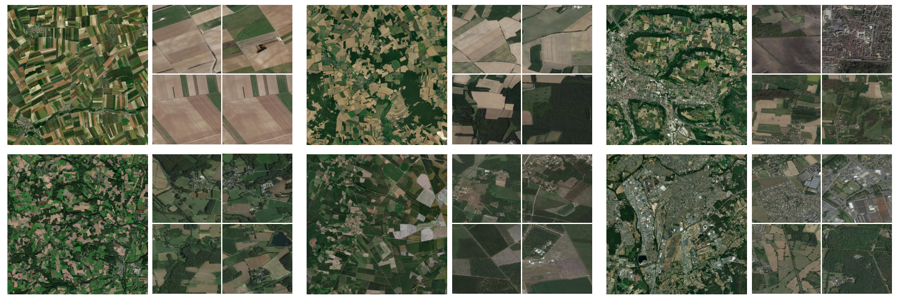
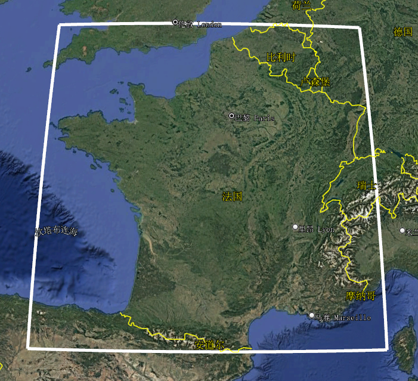
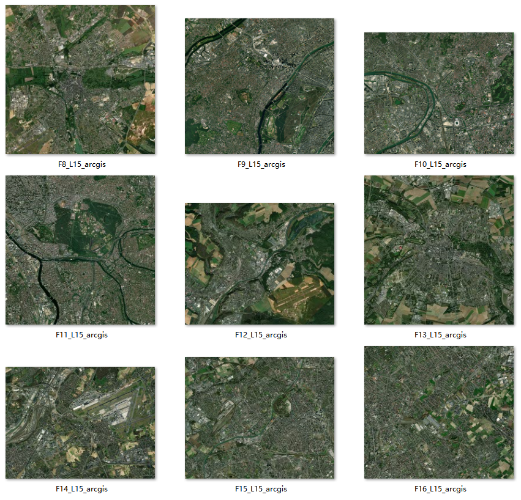
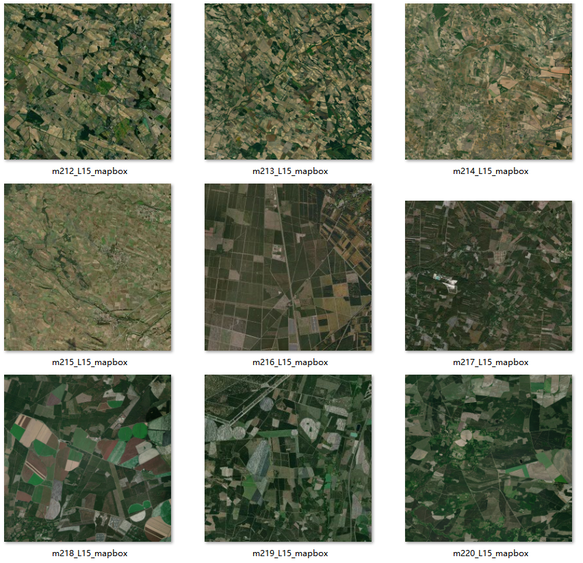

# RSLoc-82K: A Large-Scale Benchmark for Remote Sensing Image Geo-Localization

#### Official dataset for the paper "Large-Scale Geo-Localization of Remote Sensing Images: A Three-Stage Framework Leveraging Maximal Clique Theory."
#### National Key Laboratory of Surveying, Mapping and Remote Sensing (Wuhan University)

---

## 💬 Introduction

**RSLoc-82K** is the first open-source benchmark dataset for large-scale remote sensing image geo-localization tasks, designed to promote high-precision geospatial perception research in complex scenarios.

The dataset contains **82,000+** high-resolution remote sensing images covering **1 million square kilometers** of diverse terrain, supporting the evaluation of geospatial modeling-based localization algorithms.

🔗 **Data Access** | 📄 [Paper Link (To Be Published)]() | 📦 [Dataset](https://github.com/SandraPky/RSLoc-82K) | 💻 [Code Repository](https://github.com/SandraPky/RSLoc-82K)


## 🌍 Dataset Highlights


Example images from the RSLoc-82K dataset: query image/reference image pair (partial).
  
### 🚀 Design Goals
- Fill the gaps in existing datasets (e.g., University-1652, SUES-200) in terms of scale and scene coverage.
- Provide a standardized benchmark to evaluate the robustness, generalization, and computational efficiency of large-scale geo-localization algorithms.

### 📊 Key Features
- **Reference Gallery: Large-Scale, Continuous Coverage**  
  
  Contains ***multi-level***, ***multi-resolution***, and ***multi-temporal*** satellite remote sensing images, covering various terrains.
   
    | Zoom level | Tile Count | Time Range                         | Resolution (m/px) | Tile Spacing |
    |-------------|------------|-------------------------------------|-------------------|--------------|
    | 13          | 66,144     | 2020/12/31                          | 19.109            | 4891.970m    |
    | 14          | 240,400    | 1985-12-31 to 2023-8-16             | 9.554             | 2445.985m    |
    | 15     | 824,796| 1991-12-31 to 2023-8-16     | 4.777             | 1222.991m    |
    | 16          | 3,216,120  | 1991-12-31 to 2023-8-16             | 2.389             | 611.494m     |
    | Total       | 4,347,460  | 1985-12-31 to 2020-12-31            | —                 | —            |

   Among these, the ***Level 15*** image data is the primary reference used in the paper, containing ***820,000+*** geo-referenced images with a resolution of about ***4.777m***.
    - Continuous geospatial coverage of the reference gallery
    
    
    - Reference gallery data information
    


- **Real-World Scene Challenges**  

  The query set contains ***500*** images with large-scale scenes that can be cropped. They are mainly divided into ***urban (48 images)*** and ***non-urban (352 images)*** remote sensing scenes.
  
  - Query image: ***Urban*** scene (F* files)
  

  - Query image: ***Non-urban*** scene (a*/b* files)
  

- **Complete Geospatial Information**  
    
    The dataset provides TIFF-format metadata images, allowing you to retrieve pixel coordinates/coverage (WGS84), supporting the accuracy assessment of localization methods.
    
    The images are from ArcGIS (a**.tiff/F**.tiff) and Mapbox (a**.tiff**).

---

## 🗂️ Dataset Download and Structure

RSLoc-82K/  \
├── RSimages/ # Query set (500 images)  \
│   ├── [test100](https://drive.google.com/file/d/1UrY4ZTH1hpUsdQuwDZTyp90--GgiX2FS/view?usp=drive_link) /  # 用于参数测试  \
│   │    └── XXX.tiff  \
│   ├── [test400](https://drive.google.com/file/d/1vu6n1yaNBWjLipFP2TQhBOGJBbYP2z8W/view?usp=drive_link) /  # 用于验证  \
│   │    └── XXX.tiff  \
│   │  \
│   └── test100.csv    # Geospatial information of the images (center coordinates, zoom level, size, resolution, satellite, geographic bounds)  \
│   └── test400.csv    #   \
│  \
└── Gallery/  # Reference gallery (continuous coverage images)  \
│   ├── gallery.db  # Multi-level, large data size; please contact the author for access  \
│   └── [galleryL15.db]()  # L15 level 820,000+ images  \
│   \
└── demo/  # Data processing tools

---

## 📥 Dataset Usage
### Gallery
- Visualization

    The ***gallery.db/galleryL15.db*** database is in ***SQLite*** format. You can open it using database software such as ***DBeaver*** to view the images.

- Data Access(Python environment)

Python environment:
```bash
import sqlite3
import numpy as np
import cv2
```
```bash
### demo/gallery.py

### Data extraction and save as JPG
gallery_dir = './RSLoc-82K/galleryL15.db'
connection = sqlite3.connect(gallery_dir)
cursor = connection.cursor()
sql = "select rowid,zoom_level,tile_column,tile_row,time_ from ge_tiles"
cursor.execute(sql)
rows = cursor.fetchall()
for row in rows:
    rowid,zoom_level, tile_column, tile_row, time,tile_data = row
    image = np.asarray(bytearray(tile_data), dtype="uint8")
    image = cv2.imdecode(image, cv2.IMREAD_COLOR)
    
    # ... Image processing
    
    cv2.imwrite('./img_dir/imgname.jpg', image)
```

```bash
### Stitch 3x3 tiles into a large image
def extract_db_image_expand_np(connection,level,col,row, size=3):
    cursor = connection.cursor()
    trans_image = np.ones((256*size, 256*size, 3), dtype=np.uint8) * 255  # 初始化图像矩阵
    s = int(size / 2)  #
    s_ = -s
    for i in range(s_,s+1,1):
        for j in range(s_,s+1,1):
            clevel = level
            ccol = col + j
            crow = row + i
            sql = f"select rowid,tile_data  from ge_tiles where zoom_level = {clevel} and tile_column = {ccol} and tile_row = {crow}"
            cursor.execute(sql)
            rows = cursor.fetchmany(1)
            if len(rows) == 0:
                continue
            # 获取图像数据并进行解码、拼接
            rowid, tile_data = rows[0]
            image = np.asarray(bytearray(tile_data), dtype="uint8")
            image = cv2.imdecode(image, cv2.IMREAD_COLOR)
            trans_image[(i+s)*256:(i+s+1)*256,(j+s)*256:(j+s+1)*256,:] = image[:, :, :]
    return trans_image
```
```bash
### Other functions in demo/gallery.py
# Tile row/column -> center latitude/longitude
def xyztolonlat(level, col, row):

# Tile row/column -> latitude/longitude bounds
def xyztolonlatmm(level, col, row):

# Latitude/longitude -> tile row/column index
def geo_to_tile(level, lon, lat):

# Calculate spatial resolution of tile at a specific level
def compute_res(level):

```
### RS Image Data

Python environment:
```bash
from osgeo import gdal
from pyproj import CRS, transform, Transformer
```

```bash
# demo/gallery.py

# Get center latitude/longitude of geospatial image
def get_gdal_lonlat(dataset):

# Get min/max latitude/longitude bounds of geospatial image
def get_gdal_extent(dataset):

# Calculate spatial resolution of tile at a specific level
def compute_res(level):

# Get geospatial information of the image
IMG_path ='/RSLoc-82K/RSimages/test400/a1_L15_arcgis.tiff'
ds = gdal.Open(IMG_path)
width, height = ds.RasterXSize, ds.RasterYSize
lon, lat = get_gdal_lonlat(ds)
lon_min, lat_min, lon_max, lat_max = get_gdal_extent(ds)
```