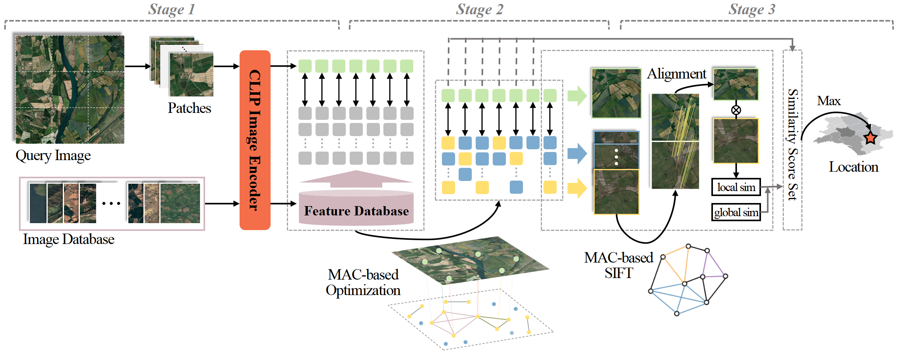

# Large-Scale Geo-Localization of Remote Sensing Images: A Three-Stage Framework Leveraging Maximal Clique Theory

🔗 **数据访问** | 📄 [论文链接（待发布）]() | 📦 [数据集](https://github.com/SandraPky/RSLoc-820K/blob/main/README_RSLoc-820K.md) | 💻 [代码仓库](https://github.com/SandraPky/RSLoc-820K)

---

Official PyTorch/C++ implementation for the paper:  
*Large-Scale Geo-Localization of Remote Sensing Images: A Three-Stage Framework Leveraging Maximal Clique Theory*

---

## Framework


This repository provides the implementation for our three-stage geo-localization framework, which integrates:
- Semantic-guided image retrieval,
- Spatio-geographic maximal clique optimization,
- MAC-guided geometric consistency validation.

---
## Dependencies:
Ensure the following packages are installed:
+ python 3.8.15
+ torch	2.1.2
+ torchvision 0.16.2
+ numpy	1.24.4
+ igraph 0.11.2
+ opencv-python	4.8.1.78
+ pyproj 3.5.0
+ qdrant-client	1.12.1
+ transformers	4.35.2
+ networkx	3.1
+ GDAL 3.6.2
+ scikit-image 0.21.0
+ sqlite 3.41.2
Install all dependencies using:

```bash
pip install -r requirements.txt
```

## Getting Started
### 1. Download Pre-trained CLIP Models
  Recommended models:
* [CLIP-ViT/L14-224](https://huggingface.co/openai/clip-vit-large-patch14)
* [CLIP-ViT/L14-336](https://huggingface.co/openai/clip-vit-large-patch14-336)
```bash
git lfs install 
git clone https://huggingface.co/openai/clip-vit-large-patch14 /project_code/model/clip-vit-large-patch14
git clone https://huggingface.co/openai/clip-vit-large-patch14-336 /project_code/model/clip-vit-large-patch14-336
```
For other backbones, please refer to their official repositories.
### 2. Prepare data

We use the [RSLoc-820K](https://github.com/SandraPky/RSLoc-820K/blob/main/README_RSLoc-820K.md) dataset.


Examples: Query (Left) and Candidate Reference Tiles (Right)
Download the dataset and place it in the correct folder as specified in the dataset README.


### 3. Run the Full Pipeline

+ Step 0: Build Gallery Index
```bash
# Python script:  ./project_code/step_1_3_python/clip_index.py
```
+ Step 1: Semantic-Guided Patch-Level Candidate Retrieval
```bash
# Python script: ./project_code/step_1_3_python/testgeosearch_gpu.py

# Set STAGE = 1
# Outputs saved in [./output/eval_L15]
# Then copy all "hits_*.csv" files to [./output/hits]

```
+ Step 2: Spatio-Geographic Constrained Maximal Clique Optimization
```bash
# Compile and run C++ code
# Edit ./project_code/step_2_cpp/findclique/main.cpp

const char* csv_dir = "./output/hits";
const char* target_dir = "./output/cli";

# Then copy all "clique_*.csv" files to [./output/eval_L15]
```

+ Step 3: . MAC-Guided Geometric Consistency for Fine Localization
```bash
# Python script: ./project_code/step_1_3_python/testgeosearch_gpu.py
# Set STAGE = 2
# The results in [./output/eval_L15/S2]
```

## Citation

If you find our work helpful in your research, please cite it as:

```
@article{__2025,
  title={Large-Scale Geo-Localization of Remote Sensing Images: A Three-Stage Framework Leveraging Maximal Clique Theory},
  author={Keyue Pan},
  journal={TGRS},
  year={2025}
}
```

## Acknowledgement

We gratefully acknowledge the open-source release of [CLIP](https://github.com/jeonsworld/ViT-pytorch) by OpenAI, based on the paper: [Learning Transferable Visual Models From Natural Language Supervision](https://arxiv.org/abs/2103.00020)

