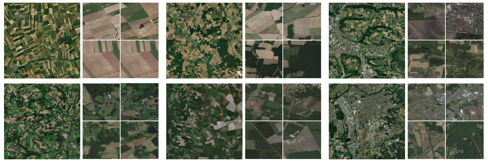

# RSLoc-82K: A Large-Scale Benchmark for Remote Sensing Image Geo-Localization

#### 这是论文 “Large-Scale Geo-Localization of Remote Sensing Images: A Three-Stage Framework Leveraging Maximal Clique Theory” 的官方数据集。

#### 测绘遥感信息工程全国重点实验室（武汉大学）

---

## 💬 简介

**RSLoc-82K** 是首个面向大规模遥感图像地理定位任务的开源基准数据集，旨在推动复杂场景下的高精度地理空间感知研究。

本数据集包含 **82,000+** 高分辨率遥感影像，覆盖 **100万平方公里** 的多样化地形，支持基于地理空间建模定位算法的评测。

🔗 **数据访问** | 📄 [论文链接（待发布）]() | 📦 [数据集](https://github.com/SandraPky/RSLoc-82K) | 💻 [代码仓库](https://github.com/SandraPky/RSLoc-82K)


## 🌍 数据集亮点


RSLoc-82K数据集 数据示例 待定位图像/对应参考图像（部分）
  
### 🚀 设计目标
- 填补现有数据集（如University-1652、SUES-200）在规模与场景覆盖上的不足。
- 为评估大规模地理定位算法的鲁棒性、泛化性及计算效率提供标准化基准。

### 📊 关键特性
- **参考图库集：大规模、连续覆盖**  
  
  包含**多层级**、**多分辨率**、**多时相**卫星遥感影像，覆盖多种地形
   
    | Zoom level | Tile Count | Time Range                         | Resolution (m/px) | Tile Spacing |
    |-------------|------------|-------------------------------------|-------------------|--------------|
    | 13          | 66,144     | 2020/12/31                          | 19.109            | 4891.970m    |
    | 14          | 240,400    | 1985-12-31 to 2023-8-16             | 9.554             | 2445.985m    |
    | 15     | 824,796| 1991-12-31 to 2023-8-16     | 4.777             | 1222.991m    |
    | 16          | 3,216,120  | 1991-12-31 to 2023-8-16             | 2.389             | 611.494m     |
    | Total       | 4,347,460  | 1985-12-31 to 2020-12-31            | —                 | —            |

   其中，**15层级**图像数据是论文使用的主要参考图像，包含**820,000+** 张地理参考图像 ，分辨率约 **4.777m**。
   
    - 参考图库集连续覆盖的地理范围
    
    
    - 参考图库集 数据信息
    


- **真实场景挑战**  

  待定位图像**400**张，尺度较大可进行切割，主要分为**城市(48张)**和**非城市(352张)**遥感场景。
  
  - 待定位图像：**城市**场景（F*文件）
  

  - 待定位图像：**非城市**场景（a*/b*文件）
  

- **地理信息完整**  
    
    数据集中提供tiff格式的元数据图像，可获得图像具体像素坐标/覆盖范围（WGS84），支持定位方法的准确性评估。
    
    图像来自arcgis（a**.tiff/F**.tiff）和mapbox(a**.tiff)。

---

## 🗂️ 数据集下载与结构

RSLoc-82K/  \
├── RSimages/ # 测试集（500张）  \
│   ├── [test100](https://drive.google.com/file/d/1UrY4ZTH1hpUsdQuwDZTyp90--GgiX2FS/view?usp=drive_link) /  # 用于参数测试  \
│   │    └── XXX.tiff  \
│   ├── [test400](https://drive.google.com/file/d/1vu6n1yaNBWjLipFP2TQhBOGJBbYP2z8W/view?usp=drive_link) /  # 用于验证  \
│   │    └── XXX.tiff  \
│   │  \
│   └── test100.csv    # 图像对应地理信息（中心坐标、层级、尺寸、分辨率、卫星、地理坐标范围）  \
│   └── test400.csv    #   \
│  \
└── Gallery/  # 图库集（参考数据库，连续覆盖，超过820,000张）  \
│   ├── gallery.db  # 多层级，数据规模太大有需要请联系作者邮箱，  \
│   └── [galleryL15.db]()  # L15层级   \
│   \
└── demo/  # 数据处理工具

---

## 📥 数据集 使用
### 图库集Gallery
- 可视化

    数据库软件图库集 gallery.db/galleryL15.db 为SQLite数据格式，可用DBeaver等数据库软件打开查看

- 数据调用

    python 语言环境
    
    demo/gallery.py

```bash
### 数据提取为缓存/保存为jpg
import sqlite3
import numpy as np
import cv2

gallery_dir = './RSLoc-82K/galleryL15.db'
connection = sqlite3.connect(gallery_dir)
cursor = connection.cursor()
sql = "select rowid,zoom_level,tile_column,tile_row,time_ from ge_tiles"
cursor.execute(sql)
rows = cursor.fetchall()
for row in rows:
    rowid,zoom_level, tile_column, tile_row, time,tile_data = row
    image = np.asarray(bytearray(tile_data), dtype="uint8")
    image = cv2.imdecode(image, cv2.IMREAD_COLOR)
    # ... 图像数据处理
    cv2.imwrite('./img_dir/imgname.jpg', image)
```

```bash
### 拼接3*3瓦片为大尺寸图像
def extract_db_image_expand_np(connection,level,col,row, size=3):
    cursor = connection.cursor()
    trans_image = np.ones((256*size, 256*size, 3), dtype=np.uint8) * 255  # 初始化图像矩阵
    s = int(size / 2)  #
    s_ = -s
    for i in range(s_,s+1,1):
        for j in range(s_,s+1,1):
            clevel = level
            ccol = col + j
            crow = row + i
            sql = f"select rowid,tile_data  from ge_tiles where zoom_level = {clevel} and tile_column = {ccol} and tile_row = {crow}"
            cursor.execute(sql)
            rows = cursor.fetchmany(1)
            if len(rows) == 0:
                continue
            # 获取图像数据并进行解码、拼接
            rowid, tile_data = rows[0]
            image = np.asarray(bytearray(tile_data), dtype="uint8")
            image = cv2.imdecode(image, cv2.IMREAD_COLOR)
            trans_image[(i+s)*256:(i+s+1)*256,(j+s)*256:(j+s+1)*256,:] = image[:, :, :]
    return trans_image
```
```bash
### 其他见 demo/gallery.py
# 行列号->中心经纬度
def xyztolonlat(level, col, row):

#行列号->经纬度范围
def xyztolonlatmm(level, col, row):

# 经纬度->行列号索引
def geo_to_tile(level, lon, lat):

# 计算层级瓦片的空间分辨率
def compute_res(level):

```
### RS图像数据
```bash
# demo/gallery.py
from osgeo import gdal
from pyproj import CRS, transform, Transformer

# 地理图像中心经纬度
def get_gdal_lonlat(dataset):

# 地理图像最大最小经纬度
def get_gdal_extent(dataset):

# 计算层级瓦片的空间分辨率
def compute_res(level):

# 获取图像中地理信息
IMG_path ='/RSLoc-82K/RSimages/test400/a1_L15_arcgis.tiff'
ds = gdal.Open(IMG_path)
width, height = ds.RasterXSize, ds.RasterYSize
lon, lat = get_gdal_lonlat(ds)
lon_min, lat_min, lon_max, lat_max = get_gdal_extent(ds)
```